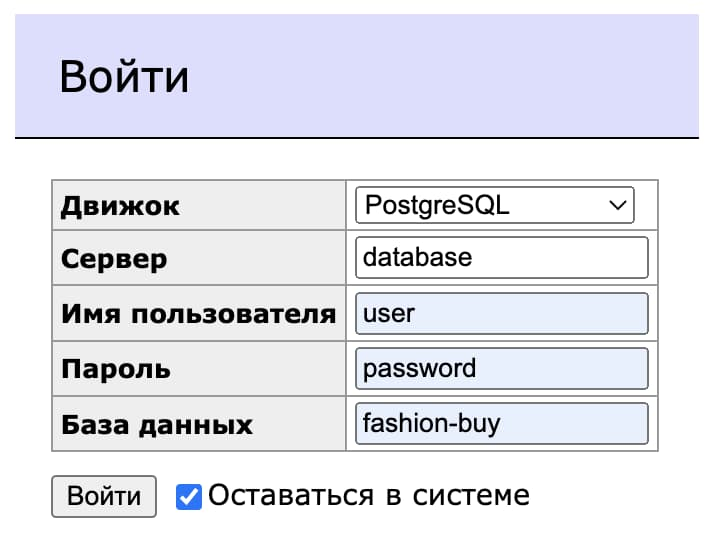

# Fashion-Buy

## Развернуть проект

Чтобы развернуть проект, нужно чтобы был установлен докер и node версии 14.18.3.
Далее нужно склонировать репозиторий, зайти в него и выполнить команды:

```bash
# Устанавливаем зависимости
yarn install

# Запуск базы данных и админки для удобной работы с ней
docker-compose up -d

# Запуск api в режиме разработки
yarn start:api
```

Когда база данных запустилась, нужно перейти на localhost:8080, где будет
отображаться интерфейс [adminer](https://www.adminer.org/). Чтобы подключиться к
базе данных, нужно заполнить поля следующим образом:



По умолчанию, для имени пользователя, пароля и имени базы будут использоваться
данные, указанные в файле docker-compose. Установить другие значения можно с
помощью переменных окружения. Более того, предполагается, что именно это и будет
делаться в production режиме.

Когда работа с проектом окончена, можно остановить работу базы данных:

```bash
docker-compose down
```

## Команды

В проекте настроены команды для запуска разных приложений в режиме разработки.
Все они начинаются со слова *start* и далее идёт название приложения. Так
например, если нужно разрабатывать api, запустить его в режиме разработки можно
с помощью команды *yarn start:api*. То же самое и с другими приложениями.
